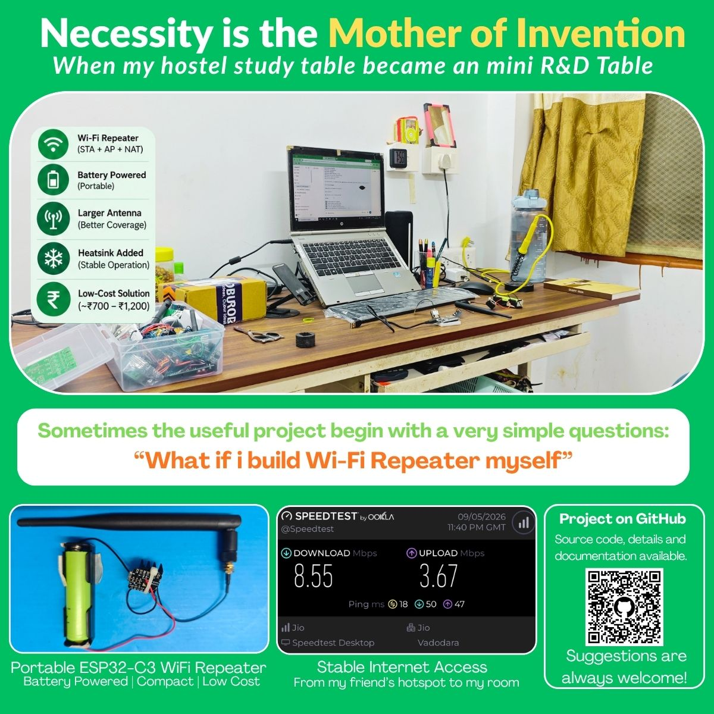

# 📡 XIAO ESP32-C3 Wi-Fi Repeater

<div align="center">

### A Compact Wi-Fi Repeater & NAT Router using Seeed Studio XIAO ESP32-C3

[](https://www.espressif.com/)
[](https://www.seeedstudio.com/XIAO-ESP32C3-p-5431.html)
[](https://www.arduino.cc/)
[](https://www.wi-fi.org/)
[](LICENSE)

**A low-cost Wi-Fi repeater using the Seeed Studio XIAO ESP32-C3.**

</div>

---

## 📌 Overview

This project converts the **Seeed Studio XIAO ESP32-C3** into a Wi-Fi repeater.

The ESP32-C3 simultaneously operates as:

- 📥 **Station (STA)** – connects to an existing Wi-Fi router
- 📡 **Access Point (AP)** – creates a new Wi-Fi network
- 🌐 **NAT/NAPT Router** – routes traffic between the upstream and repeater networks

The project is developed using **Arduino IDE** and the **ESP32 Arduino framework**.

---

## ✨ Features

- ✅ Wi-Fi STA + AP simultaneous operation
- ✅ NAT/NAPT network routing
- ✅ Automatic upstream Wi-Fi connection
- ✅ Dedicated repeater Wi-Fi network
- ✅ DHCP for connected clients
- ✅ Serial Monitor status information
- ✅ Automatic NAPT enable/disable
- ✅ Compact and low-cost hardware
- ✅ Arduino IDE compatible
- ✅ Suitable for IoT and networking experiments

---

## 📸 Project

<div align="center">



### XIAO ESP32-C3 Wi-Fi Repeater

</div>

---

## 🧩 System Architecture

```text
                    EXISTING Wi-Fi ROUTER
                           │
                           │ 2.4 GHz Wi-Fi
                           ▼
                ┌─────────────────────┐
                │                     │
                │   XIAO ESP32-C3     │
                │                     │
                │  STA + AP + NAPT    │
                │                     │
                └──────────┬──────────┘
                           │
                           │ 2.4 GHz Wi-Fi
                           ▼
                  ┌─────────────────┐
                  │  REPEATER Wi-Fi │
                  │       AP        │
                  └────────┬────────┘
                           │
              ┌────────────┼────────────┐
              │            │            │
              ▼            ▼            ▼
           📱 Phone      💻 Laptop     🤖 IoT
```

---

# 🔧 Hardware Requirements

## Main Hardware

| Component | Specification | Quantity |
|---|---|---:|
| **Seeed Studio XIAO ESP32-C3** | ESP32-C3 RISC-V MCU, 2.4 GHz Wi-Fi | 1 |
| **USB Type-C Data Cable** | USB data + power cable | 1 |
| **2.4 GHz Wi-Fi Router** | Existing Wi-Fi network | 1 |
| **Wi-Fi Client Device** | Smartphone / Laptop / PC / IoT device | 1 or more |

## Power Supply

| Component | Specification | Quantity |
|---|---|---:|
| USB Power Supply | 5 V USB supply | 1 |
| USB Power Bank | 5 V output, optional for portable operation | 1 |

## Optional Hardware

| Component | Purpose | Quantity |
|---|---|---:|
| Breadboard | Prototyping | 1 |
| Jumper Wires | Prototyping connections | As required |
| LED | Optional status indication | 1 or more |
| Resistor | LED current limiting | As required |
| Enclosure | Physical protection | Optional |

### Minimum Hardware Required

```text
1 × Seeed Studio XIAO ESP32-C3
1 × USB Type-C Data Cable
1 × 2.4 GHz Wi-Fi Router
1 × Wi-Fi-enabled Phone/Laptop for Testing
```

> No external Wi-Fi module, Ethernet module, relay, motor driver, or additional communication module is required for the basic repeater.

---

# 💻 Software Requirements

| Software | Purpose |
|---|---|
| **Arduino IDE** | Programming and uploading |
| **ESP32 Arduino Core** | ESP32-C3 support |
| **USB Driver** | PC communication if required |
| **Serial Monitor** | Debugging and status monitoring |

---

# ⚙️ Arduino IDE Setup

### 1. Install Arduino IDE

Install Arduino IDE on your computer.

### 2. Install ESP32 Board Package

Open:

```text
Tools → Board → Boards Manager
```

Search for:

```text
ESP32
```

Install the **ESP32 Arduino** package.

### 3. Select the Board

Select the XIAO ESP32-C3 board from the ESP32 board list.

```text
Tools → Board → ESP32 Arduino → XIAO ESP32C3
```

### 4. Select COM Port

```text
Tools → Port → COMx
```

Select the COM port connected to the XIAO ESP32-C3.

---

# 📁 Project Structure

```text
XIAO-ESP32-C3-WiFi-Repeater/
│
├── XIAO-ESP32-C3-WiFi-Repeater.ino
├── README.md
├── LICENSE
├── .gitignore
│
└── images/
    └── xiao-repeater.jpg
```

---

# 🔑 Wi-Fi Configuration

Open:

```text
XIAO-ESP32-C3-WiFi-Repeater.ino
```

Configure the upstream Wi-Fi:

```cpp
const char* STA_SSID = "YOUR_WIFI_SSID";
const char* STA_PASSWORD = "YOUR_WIFI_PASSWORD";
```

Configure the repeater Wi-Fi:

```cpp
const char* AP_SSID = "Host";
const char* AP_PASSWORD = "123456788";
```

> ⚠️ **Security:** Never upload your real Wi-Fi password to GitHub.

---

# 🌐 Network Configuration

The ESP32-C3 creates a separate local network.

| Parameter | Value |
|---|---|
| AP IP Address | `192.168.4.1` |
| Subnet Mask | `255.255.255.0` |
| DHCP Start | `192.168.4.2` |
| DNS Server | `8.8.8.8` |
| Wi-Fi Band | 2.4 GHz |

### Example Network

```text
             EXISTING Wi-Fi ROUTER
                    │
                    │ 2.4 GHz Wi-Fi
                    ▼
          ┌─────────────────────┐
          │   XIAO ESP32-C3     │
          │                     │
          │ STA + AP + NAPT     │
          │                     │
          │ STA: Router Network │
          │ AP : 192.168.4.1    │
          └──────────┬──────────┘
                     │
                     │ Wi-Fi
                     ▼
               192.168.4.x
                     │
          ┌──────────┼──────────┐
          ▼          ▼          ▼
       Phone      Laptop       IoT
```

---

# 🚀 How It Works

### 1. Start ESP32-C3

The ESP32-C3 initializes the Wi-Fi interfaces.

### 2. Start Access Point

The ESP32-C3 creates the repeater Wi-Fi network:

```text
SSID: Host
```

### 3. Connect to Upstream Router

The ESP32-C3 connects to the existing Wi-Fi network using STA mode.

### 4. Obtain IP Address

The upstream router provides an IP address to the ESP32-C3.

### 5. Enable NAPT

After the ESP32-C3 receives an IP address, NAPT is enabled:

```cpp
WiFi.AP.enableNAPT(true);
```

### 6. Connect Client Devices

Phones, laptops, and IoT devices connect to the ESP32-C3 Access Point.

The ESP32-C3 routes their network traffic through the upstream Wi-Fi connection.

---

# 🧪 Testing

| Test | Expected Result |
|---|---|
| ESP32-C3 starts | Wi-Fi initialized |
| STA connection | Connected to router |
| IP acquisition | Upstream IP received |
| AP creation | `Host` network visible |
| Client connection | Client receives `192.168.4.x` |
| NAPT | Network traffic routed |
| Internet test | Internet access available |

### Test Procedure

1. Connect the XIAO ESP32-C3 to USB.
2. Upload the program.
3. Open Serial Monitor.
4. Set the baud rate to **115200**.
5. Check the upstream Wi-Fi connection.
6. Search for the `Host` Wi-Fi network.
7. Connect your phone or laptop.
8. Verify that the client receives a `192.168.4.x` IP address.
9. Test Internet connectivity.

---

# 🖥️ Serial Monitor

Open:

```text
Tools → Serial Monitor
```

Set:

```text
115200 baud
```

Example output:

```text
Starting WiFi Repeater...
AP started
Connecting to upstream WiFi...
Connected!
STA IP Address: xxx.xxx.xxx.xxx
NAPT enabled
```

---

# 📊 Expected Network Operation

```text
                    INTERNET
                       │
                       ▼
                 Wi-Fi Router
                       │
                       │
              ┌────────▼────────┐
              │   XIAO ESP32-C3 │
              │                 │
              │      STA        │
              │      AP         │
              │      NAPT       │
              └────────┬────────┘
                       │
                 Repeater Wi-Fi
                       │
              ┌────────┼────────┐
              │        │        │
              ▼        ▼        ▼
           📱 Phone  💻 Laptop  🤖 IoT
```

---

# 🔒 Security

**Do not upload personal Wi-Fi credentials to GitHub.**

Use:

```cpp
const char* STA_SSID = "YOUR_WIFI_SSID";
const char* STA_PASSWORD = "YOUR_WIFI_PASSWORD";
```

instead of your actual Wi-Fi credentials.

If a real password has already been committed to Git history, consider it exposed and change the Wi-Fi password.

---

# ⚠️ Limitations

This project is mainly intended for:

- Educational applications
- Embedded networking experiments
- IoT applications
- Wi-Fi experiments
- Low-cost network extension

Performance depends on:

- Wi-Fi signal strength
- Distance from the router
- ESP32-C3 antenna performance
- 2.4 GHz interference
- Number of connected clients
- Network traffic
- ESP32-C3 hardware limitations

This project is not intended to replace a commercial high-performance Wi-Fi extender.

---

# 🔮 Future Improvements

- [ ] Web-based configuration
- [ ] Wi-Fi network scanning
- [ ] Configurable AP SSID
- [ ] Configurable AP password
- [ ] Signal strength monitoring
- [ ] Connection status webpage
- [ ] Connected-client monitoring
- [ ] OTA firmware update
- [ ] Automatic Wi-Fi selection
- [ ] Network statistics
- [ ] Web-based system information
- [ ] Improved user interface

---

# 🤝 Contribution

Contributions, suggestions, bug reports, and improvements are welcome.

## AI Assistance

**ChatGPT (OpenAI)** was used during development for:

- Programming assistance
- Code debugging
- Wi-Fi repeater architecture
- NAT/NAPT implementation guidance
- Arduino IDE troubleshooting
- Technical documentation

The final hardware implementation, programming, testing, and project decisions were carried out by the project author.

---

# 👨‍💻 Author

## Mayank Sunhare

**Electrical Engineering | Power Electronics | Embedded Systems**

GitHub:

https://github.com/MayankSunhare

---

# 🙏 Acknowledgments

- **Seeed Studio** — XIAO ESP32-C3 hardware platform
- **Espressif** — ESP32 ecosystem
- **Arduino Community** — Development platform
- **Open-source developers** — Libraries and tools
- **ChatGPT (OpenAI)** — Development assistance

---

# 📄 License

This project is licensed under the **MIT License**.

See the [LICENSE](LICENSE) file for details.

---

# ⚠️ Disclaimer

This project is provided for educational and experimental purposes.

The author is not responsible for any damage, data loss, network problems, security issues, or other consequences resulting from the use or modification of this project.

---

<div align="center">

## ⭐ If you find this project useful, please give it a Star!

### 📡 XIAO ESP32-C3 Wi-Fi Repeater

**ESP32 + Wi-Fi + NAT/NAPT + Arduino**

Made with ❤️ using ESP32 + Arduino

</div>
